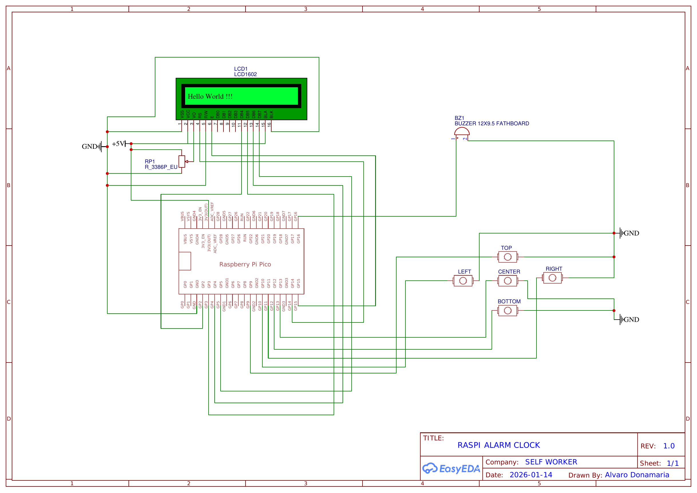

# Raspberry Pi Pico Alarm Clock

## Electric Scheme


## Build and Flash Instructions

### 1. Prerequisites
- CMake (version 3.13 or newer)
- GNU Arm Embedded Toolchain (`gcc-arm-none-eabi`)
- Raspberry Pi Pico SDK
- Build tools: `make`

### 2. Set Up the Pico SDK
Clone the Pico SDK (if you haven't already):
```bash
git clone -b master https://github.com/raspberrypi/pico-sdk.git ~/pico-sdk
```

### 3. Set the PICO_SDK_PATH Environment Variable
Before building, set the environment variable so CMake can find the SDK:
```bash
export PICO_SDK_PATH=~/pico-sdk
```

### 4. Create and Enter the Build Directory
```bash
mkdir -p build
cd build
```

### 5. Configure the Project with CMake
```bash
cmake ..
```

### 6. Build the Project
```bash
make
```
This will generate several files, including `alarm_clock.uf2` in the `build` directory.

### 7. Flash the Pico
1. Hold down the BOOTSEL button on your Pico and plug it into your computer via USB.
2. Release the BOOTSEL button. The Pico will appear as a USB drive.
3. Copy the generated `.uf2` file (e.g., `alarm_clock.uf2`) onto the Pico's USB drive.

---

### Output Files
- `.uf2`: Use this file to flash your Pico (drag-and-drop).
- `.elf`, `.bin`, `.hex`, `.map`: For debugging and advanced use.
### Troubleshooting: UF2 File Not Generated

If you run the `make` command and the `alarm_clock.uf2` file is **not** generated in the `build` directory, try the following steps:

1. **Remove all generated `alarm_clock` files in the build folder:**
   ```bash
   rm alarm_clock.*
   ```
   *(Run this command inside the `build` directory. It will remove files like `alarm_clock.elf`, `alarm_clock.uf2`, `alarm_clock.bin`, etc.)*

2. **Re-run the `make` command:**
   ```bash
   make
   ```

This can help resolve issues where stale or corrupted build files prevent the UF2 from being generated.
